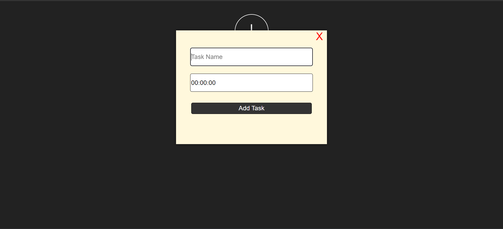
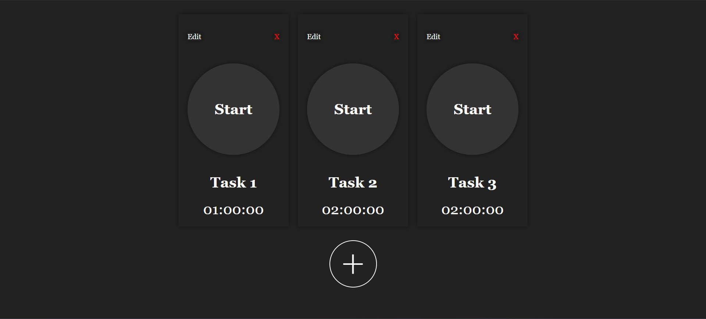
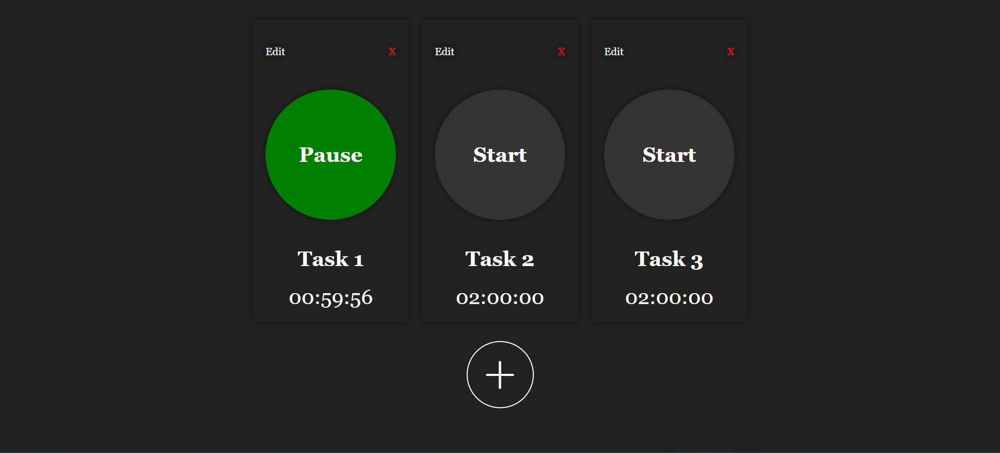

# About

Fully react states and hooks based web application using which you can set multiple timers for your task, and spend only the required time on the task. This helps you monitor how much time have you planned for the task and how much have you actually spent on it.

# How to use this application?

1. Make a schedule and set timers according to how much time you want to spend on each task.

   

   
2. Start the timer and spend only the required time on the task to work efficiently.

   

# Run Locally

1. Clone the repository:
    ``git clone https://github.com/k3x9/timer.git``
2. Navigate to the timer folder and start the application:
    ``cd timer``
    ``npm start``
